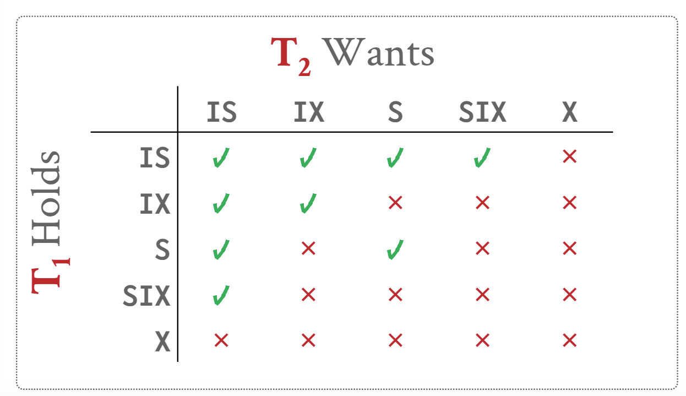
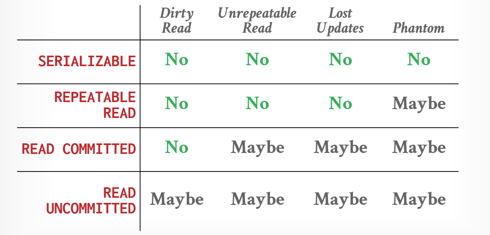
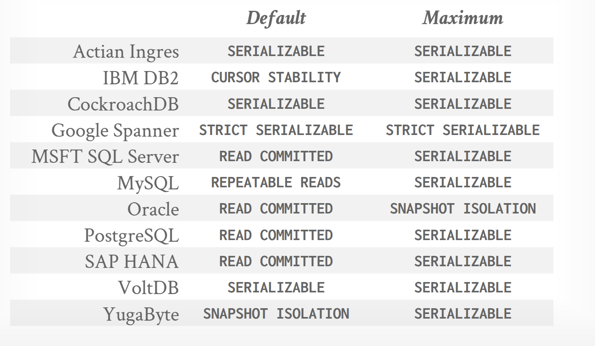

- Atomic (原子性) 事务或者全部执行或者不执行(通过REDO-UNDO机制保证原子性)
    1. Logging: DBMS记录所有的action，所以它可以undo the action， 同时维护在内存和硬盘中维护日志
    2. Shadow Paging: DBMS拷贝需要修改的页面，事务只在这些拷贝的页面上进行更改，只有事务commit后，这些页面才对其他事务可见。
        (it is a bad idea, DONOT DO THIS!: 会在磁盘上形成碎片，无法顺序读写)

- Consistency (一致性) 数据库必须确保事务执行前和执行后都符合`完整性约束(key definition, CHECK, ADD CONSTRAINT)`

- Isolation (隔离性) 事务在执行时就好像当前只有自己在执行，没有任何其他事务。(通过并法控制保证隔离性)
    两种协议类型去实现隔离性:
    1. Pessimistic: 不让问题出现
    2. Optimistic: 假设冲突是罕见的，当他们发生时再处理

- Durability (持久性) 所有已经commit的事务的更改都应该被持久化。(通过REDO-UNDO机制保证持久性)

***

五种异常：

    1. 不可重复读（Read-Write）
        一个事务读后，同一个数据被另一个事务写。对于第一个事务来说，再一次读同一个数据后，两次读的结果不同。即为不可重复读

    2. 脏读 (Write-Read)
        一个事务写后，另一个事务读该数据，第二个事务读到的是第一个事务写后的脏数据。

    3. 丢失更新 (Write-Write)
        一个事务写后，另一个事务也写。第一个事务对数据的更新丢失了

    4. 幻读 (Scan-Write)
        一个事务多次扫描一个range, 另一个事务在该range中插入或删除tuple, 多次扫描得到的结果不一样。

    5. 写偏斜Write-Skew (Read-Write)

***

Two-phase locking(2PL) 两阶段锁, **使用2PL的调度是可序列化的**

1. 阶段1： Growing
    事务向lock manager请求它需要的锁
    lock manager 授权或拒绝事务的请求

2. 阶段2： Shrinking
    在这个阶段，事务只被允许释放或降级在阶段1中获取到的锁，不能再请求新锁

2PL的不足

1. 2PL会导致`Cascading Abort`问题, `Cascading Abort`问题是当一个事务Abort时
与它同时执行并且在数据上有依赖的其他事务也必须Abort, 回滚并重新执行。这会导致
严重的性能问题。可以使用Strong 2PL解决

        Strong 2PL 没有Cascading Abort问题

2. 2PL仍然可能出现脏读。可以使用Strong 2PL解决

    Strong 2PL在Shrinking阶段不会释放锁，直到事务commit时一起释放

    

3. 2PL可能导致死锁。 死锁检测和死锁避免
    - 死锁检测
        构建一个等待图，如果事务$T_{i}$等待$T_{j}$持有的锁，就从$T_{i}$到$T_{j}$连一条边。

        使用一个background worker定时检测等待图中是否有环。如果有环，Rollback环中的一个事务，并重新执行或Abort。

*** 

我们需要在锁的粒度和锁的个数之间作权衡。

    - 锁的粒度大，需要的锁的数量少，但是会降低并行度
    - 锁的粒度小，需要的锁的数量多，会降低性能

数据库引入意向锁(Intention Lock), 意向锁有三种类型

1. Intention-Shared(IS)
2. Intention-Exclusive(IX)
3. Shared+Intention-Exclusive(SIX)

***

OCC(Optimistic Concurrency Control)

OCC为每个事务创建一个`private workspace`, 

事务读的数据被复制到该私有空间，写数据也在该私有空间中发生。

当事务commit时，数据库比较该私有空间与其他事务的私有空间是否冲突，
如果无冲突，将该私有空间`install`到全局的数据库中

OCC分为三个阶段

1. Read

        从全局数据库中复制事务访问到的数据到私有空间中，并在私有空间中进行数据的更新

2. Validation

        当所有的数据读写已完成，在事务commit前，进入Validation阶段。在该阶段，事务被分配一个
        时间戳并检查是否与其他事务冲突。

    Validation 需要进行`forward validation`**或**`backward validation`(只需要其中一个)
    - forward validation
        检查将要commit的事务的读写集合(保存在private workspace中)是否与其他**还没**commit的事务的读写集合相交
    - backward validation
        检查将要commit的事务的读写集合(保存在private workspace中)是否与其他**已经**ommit的事务的读写集合相交

3. Write

        如果通过Validation阶段的检查，将私有空间的数据修改应用到全局数据库中。

OCC的问题：

1. 拷贝数据开销大
2. Validation/Write可能导致瓶颈
3. Abort一个事务造成的浪费比2PL更大，因为OCC只可能在事务已经完成后、commit前Abort

***

Isolation Levels

1. Serializable(可序列化) ： 无幻读、无不可重复读、无脏读
    
    使用Strong strict 2PL 和幻读保护(通过index locking)

2. Repeatable Reads： 幻读可能会发生

    使用Strong strict 2PL

3. Read Commited:  幻读、不可重复读、丢失更新可能会发生

    使用Strong strict 2PL，但是会立即释放S lock
    
4. Read Uncommited:  所有的异常都可能会发生
    
    使用Strong strict 2PL, 但是不使用S lock

5. Snapshot Isolation

    当一个事务开始时，它得到一个数据库在此时刻的快照

    Snapshot Isolation 会导致`Write-Skew`异常

***

## MVCC

数据库维护一个逻辑对象的多个物理版本

当事务写一个对象时，数据库创建一个该对象的新版本

当事务读一个对象时，它读事务开始时数据库中该对象的最新版本

### Version Storage

### Garbage Collection

### Index Management

### Delete
