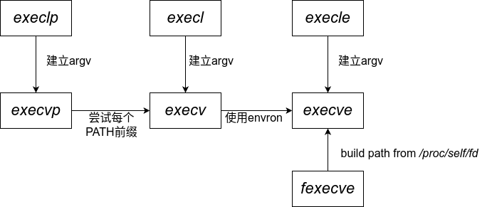

## exec

使用fork函数创建新的子进程后，子进程可以使用`exec`函数执行另一个程序

`exec`函数并不创建新进程，只是用磁盘上的一个新程序替换了当前进程的**正文段、数据段、堆段、栈段**

有7中不同的`exec`函数：

```c
#incluce <unistd.h>

int execl(const char* pathname, const char* arg0, ... /*, (char*)NULL */);

int execv(const char* pathname, char* const argv[]);

int execle(const char* pathname, const char *arg0, ... /* (char*)NULL, char *const envp[] */);

int execve(const char* pathname, char *const argv[], char *const envp[]);

int execlp(const char* filename, const char *arg0, ... /* (char*)NULL */);

int execvp(const char* filename, char* const argv[]);

int fexecve(int fd, char *const argv[], char *const envp[]);
```

这7个函数有三个区别

1. 前4个函数取路径名作为参数，后2个函数取文件名作为参数，最后一个函数取文件描述符作为参数
    
    (1-4): 路径名应该为可执行文件的**绝对路径**
    (5-6): 函数会在**PATH**环境变量下搜索文件名，找不到则报错

2. 第二个区别是参数表的传递(l 表示list, v 表示vector)

    无论使用哪种方式传递参数，第一个参数必须是程序的标识符（通常为程序名字），最后一个参数必须是NULL，表示参数传递完成

3. 第三个区别是是否向新程序传递环境表（e 表示环境）

    `execle`, `execve`, `fexecve`可以向新程序传递一个环境变量的表

***

这7个函数只有`execve`是系统调用，其他均为库函数，通过直接或间接调用`execve`实现功能

7个函数之间的关系如图所示：


